```python
import pandas as pd
import numpy as np
import matplotlib.pyplot as plt  # For plotting graphs
from datetime import datetime    # To access datetime
from pandas import Series        # To work on series
%matplotlib inline
import warnings                   # To ignore the warnings
warnings.filterwarnings("ignore")
```


```python
train=pd.read_csv("Train_SU63ISt.csv")
```


    ---------------------------------------------------------------------------

    FileNotFoundError                         Traceback (most recent call last)

    <ipython-input-3-5b47b262897d> in <module>()
    ----> 1 train=pd.read_csv("Train_SU63ISt.csv")


    /anaconda3/lib/python3.6/site-packages/pandas/io/parsers.py in parser_f(filepath_or_buffer, sep, delimiter, header, names, index_col, usecols, squeeze, prefix, mangle_dupe_cols, dtype, engine, converters, true_values, false_values, skipinitialspace, skiprows, nrows, na_values, keep_default_na, na_filter, verbose, skip_blank_lines, parse_dates, infer_datetime_format, keep_date_col, date_parser, dayfirst, iterator, chunksize, compression, thousands, decimal, lineterminator, quotechar, quoting, escapechar, comment, encoding, dialect, tupleize_cols, error_bad_lines, warn_bad_lines, skipfooter, doublequote, delim_whitespace, low_memory, memory_map, float_precision)
        676                     skip_blank_lines=skip_blank_lines)
        677
    --> 678         return _read(filepath_or_buffer, kwds)
        679
        680     parser_f.__name__ = name


    /anaconda3/lib/python3.6/site-packages/pandas/io/parsers.py in _read(filepath_or_buffer, kwds)
        438
        439     # Create the parser.
    --> 440     parser = TextFileReader(filepath_or_buffer, **kwds)
        441
        442     if chunksize or iterator:


    /anaconda3/lib/python3.6/site-packages/pandas/io/parsers.py in __init__(self, f, engine, **kwds)
        785             self.options['has_index_names'] = kwds['has_index_names']
        786
    --> 787         self._make_engine(self.engine)
        788
        789     def close(self):


    /anaconda3/lib/python3.6/site-packages/pandas/io/parsers.py in _make_engine(self, engine)
       1012     def _make_engine(self, engine='c'):
       1013         if engine == 'c':
    -> 1014             self._engine = CParserWrapper(self.f, **self.options)
       1015         else:
       1016             if engine == 'python':


    /anaconda3/lib/python3.6/site-packages/pandas/io/parsers.py in __init__(self, src, **kwds)
       1706         kwds['usecols'] = self.usecols
       1707
    -> 1708         self._reader = parsers.TextReader(src, **kwds)
       1709
       1710         passed_names = self.names is None


    pandas/_libs/parsers.pyx in pandas._libs.parsers.TextReader.__cinit__()


    pandas/_libs/parsers.pyx in pandas._libs.parsers.TextReader._setup_parser_source()


    FileNotFoundError: File b'Train_SU63ISt.csv' does not exist


```python
train=pd.read_csv("Train_SU63ISt.csv")
```


```python
test=pd.read_csv("Test_0qrQsBZ.csv")
```


```python
train_original=train.copy()
test_original=test.copy()
```


```python
train.columns, test.columns
```


    (Index(['ID', 'Datetime', 'Count'], dtype='object'),
     Index(['ID', 'Datetime'], dtype='object'))


```python
train.dtypes, test.dtypes
```


    (ID           int64
     Datetime    object
     Count        int64
     dtype: object, ID           int64
     Datetime    object
     dtype: object)


```python
train.shape, test.shape
```


    ((18288, 3), (5112, 2))


```python
train['Datetime'] = pd.to_datetime(train.Datetime,format='%d-%m-%Y %H:%M')
```


```python
test['Datetime'] = pd.to_datetime(test.Datetime,format='%d-%m-%Y %H:%M')
test_original['Datetime'] = pd.to_datetime(test_original.Datetime,format='%d-%m-%Y %H:%M')
train_original['Datetime'] = pd.to_datetime(train_original.Datetime,format='%d-%m-%Y %H:%M')
```


```python
for i in (train, test, test_original, train_original):
    i['year']=i.Datetime.dt.year
    i['month']=i.Datetime.dt.month
    i['day']=i.Datetime.dt.day
    i['Hour']=i.Datetime.dt.hour
```


```python
train['day of week']=train['Datetime'].dt.dayofweek
temp = train['Datetime']
```


```python
train['day of week']=train['Datetime'].dt.dayofweek
temp = train['Datetime']
```


```python
def applyer(row):
    if row.dayofweek == 5 or row.dayofweek == 6:
        return 1
    else:
        return 0

temp2 = train['Datetime'].apply(applyer)
train['weekend']=temp2
```


```python
train.index = train['Datetime'] # indexing the Datetime to get the time period on the x-axis.
df=train.drop('ID',1)           # drop ID variable to get only the Datetime on x-axis.
ts = df['Count']
plt.figure(figsize=(16,8))
plt.plot(ts, label='Passenger Count')
plt.title('Time Series')
plt.xlabel("Time(year-month)")
plt.ylabel("Passenger count")
plt.legend(loc='best')
```


    <matplotlib.legend.Legend at 0x11549dba8>


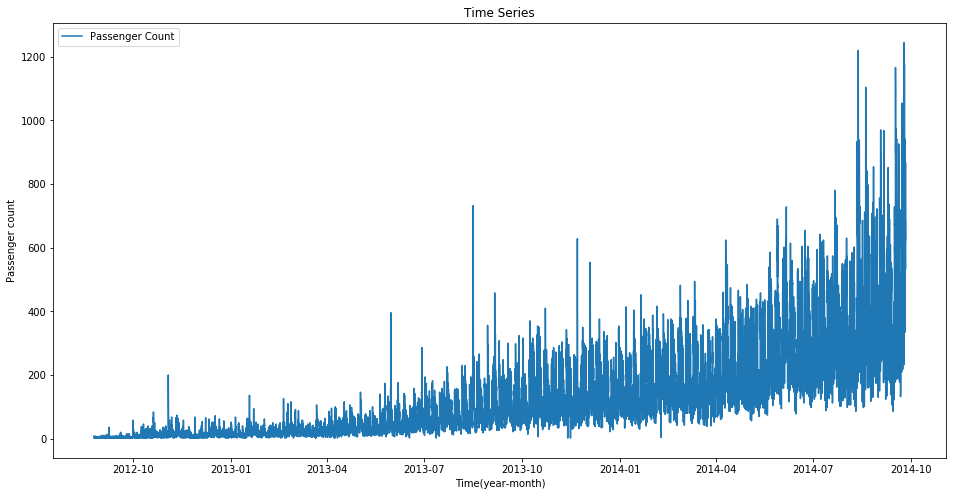


```python
train.groupby('year')['Count'].mean().plot.bar()
```


    <matplotlib.axes._subplots.AxesSubplot at 0x115130278>


```python
train.groupby('month')['Count'].mean().plot.bar()
```


    <matplotlib.axes._subplots.AxesSubplot at 0x10ffc16a0>


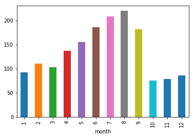


```python
temp=train.groupby(['year', 'month'])['Count'].mean()
temp.plot(figsize=(15,5), title= 'Passenger Count(Monthwise)', fontsize=14)
```


    <matplotlib.axes._subplots.AxesSubplot at 0x115122438>


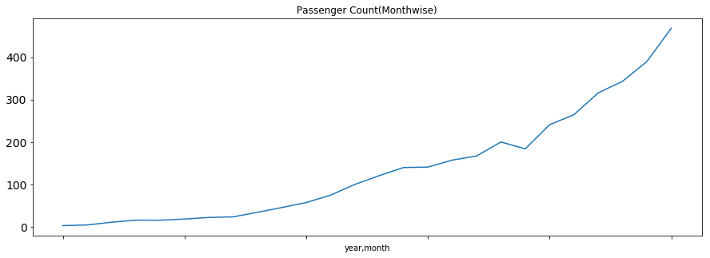


```python
train.groupby('day')['Count'].mean().plot.bar()
```


    <matplotlib.axes._subplots.AxesSubplot at 0x114eaf2b0>


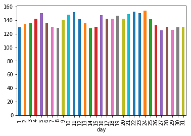


```python
train.groupby('Hour')['Count'].mean().plot.bar()
```


    <matplotlib.axes._subplots.AxesSubplot at 0x114eaf358>


```python
train.groupby('weekend')['Count'].mean().plot.bar()
```


    <matplotlib.axes._subplots.AxesSubplot at 0x10ffc11d0>


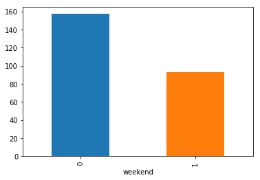


```python
train.groupby('day of week')['Count'].mean().plot.bar()
```


    <matplotlib.axes._subplots.AxesSubplot at 0x114e2add8>


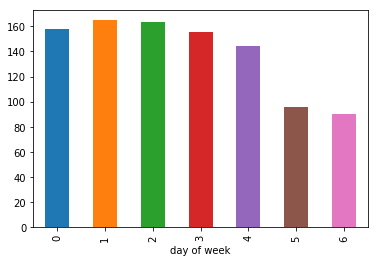


```python
train=train.drop('ID',1)
```


```python
train.Timestamp = pd.to_datetime(train.Datetime,format='%d-%m-%Y %H:%M')
train.index = train.Timestamp

# Hourly time series
hourly = train.resample('H').mean()

# Converting to daily mean
daily = train.resample('D').mean()

# Converting to weekly mean
weekly = train.resample('W').mean()

# Converting to monthly mean
monthly = train.resample('M').mean()
```


```python
fig, axs = plt.subplots(4,1)

hourly.Count.plot(figsize=(15,8), title= 'Hourly', fontsize=14, ax=axs[0])
daily.Count.plot(figsize=(15,8), title= 'Daily', fontsize=14, ax=axs[1])
weekly.Count.plot(figsize=(15,8), title= 'Weekly', fontsize=14, ax=axs[2])
monthly.Count.plot(figsize=(15,8), title= 'Monthly', fontsize=14, ax=axs[3])

plt.show()

```


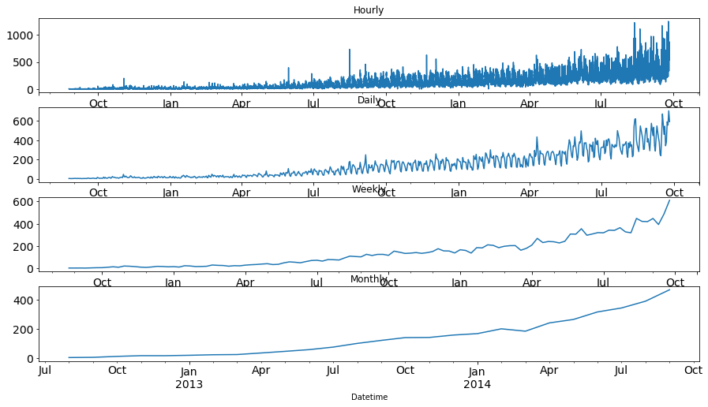


```python
test.Timestamp = pd.to_datetime(test.Datetime,format='%d-%m-%Y %H:%M')
test.index = test.Timestamp

# Converting to daily mean
test = test.resample('D').mean()

train.Timestamp = pd.to_datetime(train.Datetime,format='%d-%m-%Y %H:%M')
train.index = train.Timestamp

# Converting to daily mean
train = train.resample('D').mean()
```


```python
Train=train.ix['2012-08-25':'2014-06-24']
valid=train.ix['2014-06-25':'2014-09-25']
```


```python
Train.Count.plot(figsize=(15,8), title= 'Daily Ridership', fontsize=14, label='train')
valid.Count.plot(figsize=(15,8), title= 'Daily Ridership', fontsize=14, label='valid')
plt.xlabel("Datetime")
plt.ylabel("Passenger count")
plt.legend(loc='best')
plt.show()
```


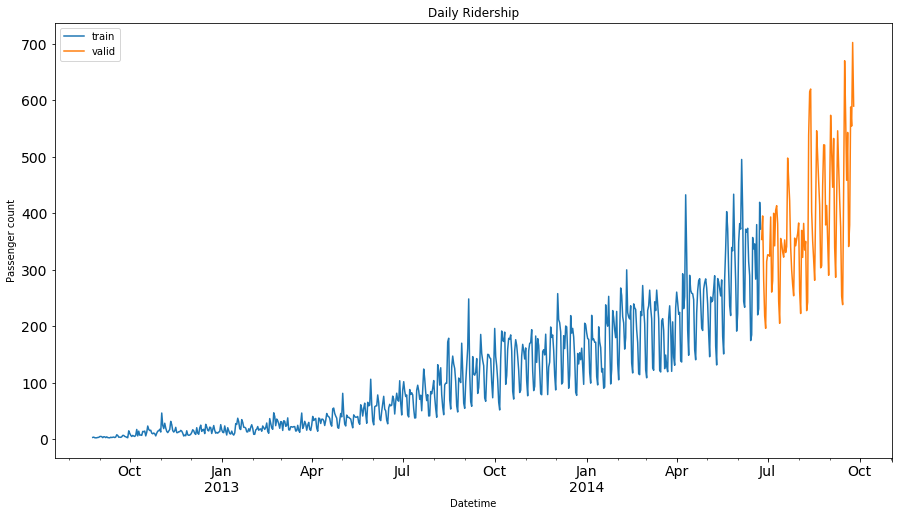


```python
dd= np.asarray(Train.Count)
y_hat = valid.copy()
y_hat['naive'] = dd[len(dd)-1]
plt.figure(figsize=(12,8))
plt.plot(Train.index, Train['Count'], label='Train')
plt.plot(valid.index,valid['Count'], label='Valid')
plt.plot(y_hat.index,y_hat['naive'], label='Naive Forecast')
plt.legend(loc='best')
plt.title("Naive Forecast")
plt.show()
```


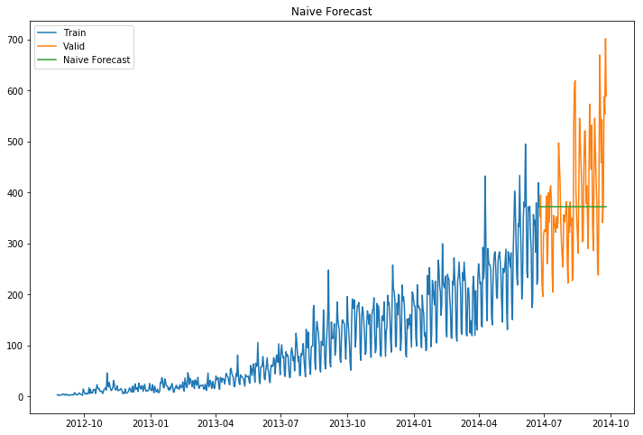


```python
from sklearn.metrics import mean_squared_error
from math import sqrt
rms = sqrt(mean_squared_error(valid.Count, y_hat.naive))
print(rms)
```

    111.79050467496724


```python
y_hat_avg = valid.copy()
y_hat_avg['moving_avg_forecast'] = Train['Count'].rolling(10).mean().iloc[-1] # average of last 10 observations.
plt.figure(figsize=(15,5))
plt.plot(Train['Count'], label='Train')
plt.plot(valid['Count'], label='Valid')
plt.plot(y_hat_avg['moving_avg_forecast'], label='Moving Average Forecast using 10 observations')
plt.legend(loc='best')
plt.show()
y_hat_avg = valid.copy()
y_hat_avg['moving_avg_forecast'] = Train['Count'].rolling(20).mean().iloc[-1] # average of last 20 observations.
plt.figure(figsize=(15,5))
plt.plot(Train['Count'], label='Train')
plt.plot(valid['Count'], label='Valid')
plt.plot(y_hat_avg['moving_avg_forecast'], label='Moving Average Forecast using 20 observations')
plt.legend(loc='best')
plt.show()
y_hat_avg = valid.copy()
y_hat_avg['moving_avg_forecast'] = Train['Count'].rolling(50).mean().iloc[-1] # average of last 50 observations.
plt.figure(figsize=(15,5))
plt.plot(Train['Count'], label='Train')
plt.plot(valid['Count'], label='Valid')
plt.plot(y_hat_avg['moving_avg_forecast'], label='Moving Average Forecast using 50 observations')
plt.legend(loc='best')
plt.show()
```


```python
rms = sqrt(mean_squared_error(valid.Count, y_hat_avg.moving_avg_forecast))
print(rms)
```

    144.19175679986802


```python
from statsmodels.tsa.api import ExponentialSmoothing, SimpleExpSmoothing, Holt
y_hat_avg = valid.copy()
fit2 = SimpleExpSmoothing(np.asarray(Train['Count'])).fit(smoothing_level=0.6,optimized=False)
y_hat_avg['SES'] = fit2.forecast(len(valid))
plt.figure(figsize=(16,8))
plt.plot(Train['Count'], label='Train')
plt.plot(valid['Count'], label='Valid')
plt.plot(y_hat_avg['SES'], label='SES')
plt.legend(loc='best')
plt.show()
```


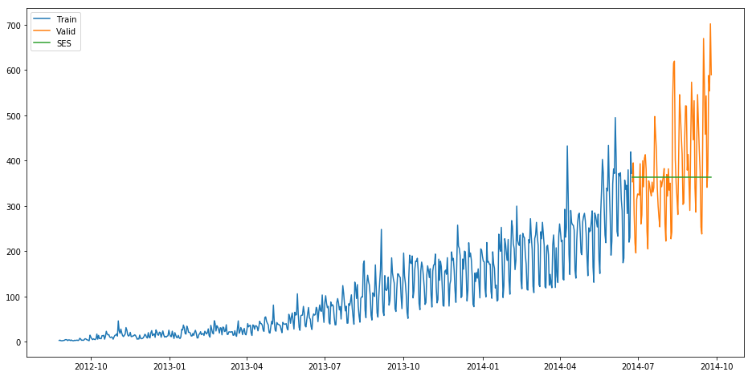


```python
import statsmodels.api as sm
sm.tsa.seasonal_decompose(Train.Count).plot()
result = sm.tsa.stattools.adfuller(train.Count)
plt.show()
```


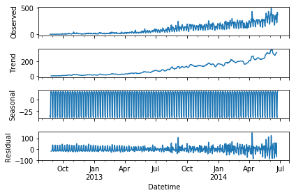


```python
y_hat_avg = valid.copy()

fit1 = Holt(np.asarray(Train['Count'])).fit(smoothing_level = 0.3,smoothing_slope = 0.1)
y_hat_avg['Holt_linear'] = fit1.forecast(len(valid))

plt.figure(figsize=(16,8))
plt.plot(Train['Count'], label='Train')
plt.plot(valid['Count'], label='Valid')
plt.plot(y_hat_avg['Holt_linear'], label='Holt_linear')
plt.legend(loc='best')
plt.show()
```


```python
rms = sqrt(mean_squared_error(valid.Count, y_hat_avg.Holt_linear))
print(rms)
```

    112.94278345314041


```python
submission=pd.read_csv("Sample_Submission_QChS6c3.csv")
```


```python
predict=fit1.forecast(len(test))
```


```python
test['prediction']=predict
```


```python
# Calculating the hourly ratio of count
train_original['ratio']=train_original['Count']/train_original['Count'].sum()

# Grouping the hourly ratio
temp=train_original.groupby(['Hour'])['ratio'].sum()

# Groupby to csv format
pd.DataFrame(temp, columns=['Hour','ratio']).to_csv('GROUPby.csv')

temp2=pd.read_csv("GROUPby.csv")
temp2=temp2.drop('Hour.1',1)

# Merge Test and test_original on day, month and year
merge=pd.merge(test, test_original, on=('day','month', 'year'), how='left')
merge['Hour']=merge['Hour_y']
merge=merge.drop(['year', 'month', 'Datetime','Hour_x','Hour_y'], axis=1)

# Predicting by merging merge and temp2
prediction=pd.merge(merge, temp2, on='Hour', how='left')

# Converting the ratio to the original scale
prediction['Count']=prediction['prediction']*prediction['ratio']*24
prediction['ID']=prediction['ID_y']
```


```python
submission=prediction.drop(['ID_x', 'day', 'ID_y','prediction','Hour', 'ratio'],axis=1)

# Converting the final submission to csv format
pd.DataFrame(submission, columns=['ID','Count']).to_csv('Holt linear.csv')
```


```python
y_hat_avg = valid.copy()
fit1 = ExponentialSmoothing(np.asarray(Train['Count']) ,seasonal_periods=7 ,trend='add', seasonal='add',).fit()
y_hat_avg['Holt_Winter'] = fit1.forecast(len(valid))
plt.figure(figsize=(16,8))
plt.plot( Train['Count'], label='Train')
plt.plot(valid['Count'], label='Valid')
plt.plot(y_hat_avg['Holt_Winter'], label='Holt_Winter')
plt.legend(loc='best')
plt.show()
```


```python
rms = sqrt(mean_squared_error(valid.Count, y_hat_avg.Holt_Winter))
print(rms)
```

    82.37527095912128


```python
predict=fit1.forecast(len(test))
```


```python
test['prediction']=predict
```


```python
# Merge Test and test_original on day, month and year
merge=pd.merge(test, test_original, on=('day','month', 'year'), how='left')
merge['Hour']=merge['Hour_y']
merge=merge.drop(['year', 'month', 'Datetime','Hour_x','Hour_y'], axis=1)

# Predicting by merging merge and temp2
prediction=pd.merge(merge, temp2, on='Hour', how='left')

# Converting the ratio to the original scale
prediction['Count']=prediction['prediction']*prediction['ratio']*24
```


```python
from statsmodels.tsa.stattools import adfuller
def test_stationarity(timeseries):

    #Determing rolling statistics
    rolmean = timeseries.rolling(24).mean() # 24 hours on each day # 24 hours on each day
    rolstd = timeseries.rolling(24).std()

    #Plot rolling statistics:
    orig = plt.plot(timeseries, color='blue',label='Original')
    mean = plt.plot(rolmean, color='red', label='Rolling Mean')
    std = plt.plot(rolstd, color='black', label = 'Rolling Std')
    plt.legend(loc='best')
    plt.title('Rolling Mean & Standard Deviation')
    plt.show(block=False)

    #Perform Dickey-Fuller test:
    print ('Results of Dickey-Fuller Test:')
    dftest = adfuller(timeseries, autolag='AIC')
    dfoutput = pd.Series(dftest[0:4], index=['Test Statistic','p-value','#Lags Used','Number of Observations Used'])
    for key,value in dftest[4].items():
        dfoutput['Critical Value (%s)'%key] = value
    print (dfoutput)
from matplotlib.pylab import rcParams
rcParams['figure.figsize'] = 20,10
test_stationarity(train_original['Count'])
```


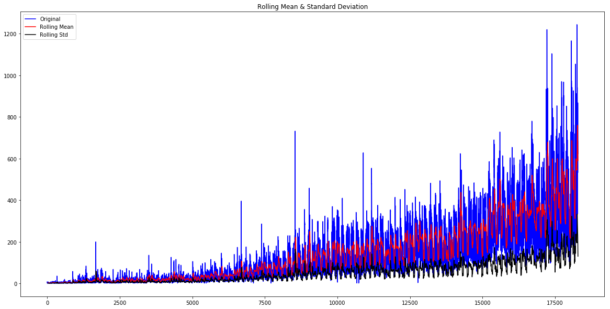


    Results of Dickey-Fuller Test:
    Test Statistic                    -4.456561
    p-value                            0.000235
    #Lags Used                        45.000000
    Number of Observations Used    18242.000000
    Critical Value (1%)               -3.430709
    Critical Value (5%)               -2.861698
    Critical Value (10%)              -2.566854
    dtype: float64


```python
Train_log = np.log(Train['Count'])
valid_log = np.log(valid['Count'])
```


```python
moving_avg = Train_log.rolling(24).mean()
plt.plot(Train_log)
plt.plot(moving_avg, color = 'red')
plt.show()
```


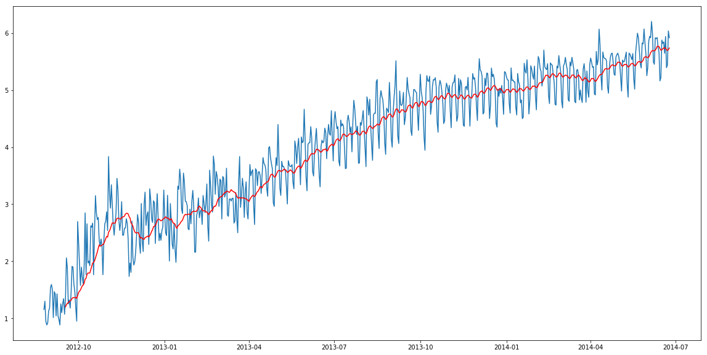


```python
train_log_moving_avg_diff = Train_log - moving_avg
```


```python
train_log_moving_avg_diff.dropna(inplace = True)
test_stationarity(train_log_moving_avg_diff)
```


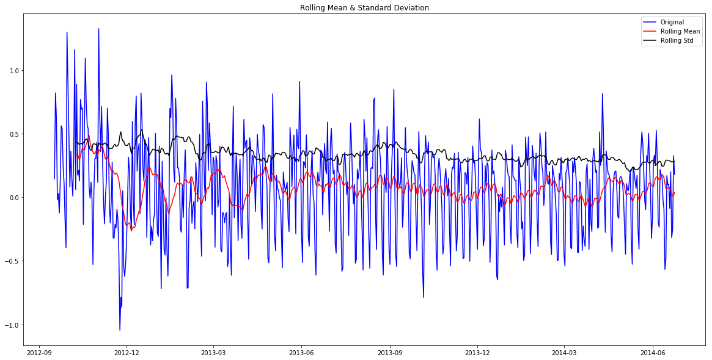


    Results of Dickey-Fuller Test:
    Test Statistic                -5.861646e+00
    p-value                        3.399422e-07
    #Lags Used                     2.000000e+01
    Number of Observations Used    6.250000e+02
    Critical Value (1%)           -3.440856e+00
    Critical Value (5%)           -2.866175e+00
    Critical Value (10%)          -2.569239e+00
    dtype: float64


```python
train_log_diff = Train_log - Train_log.shift(1)
test_stationarity(train_log_diff.dropna())
```


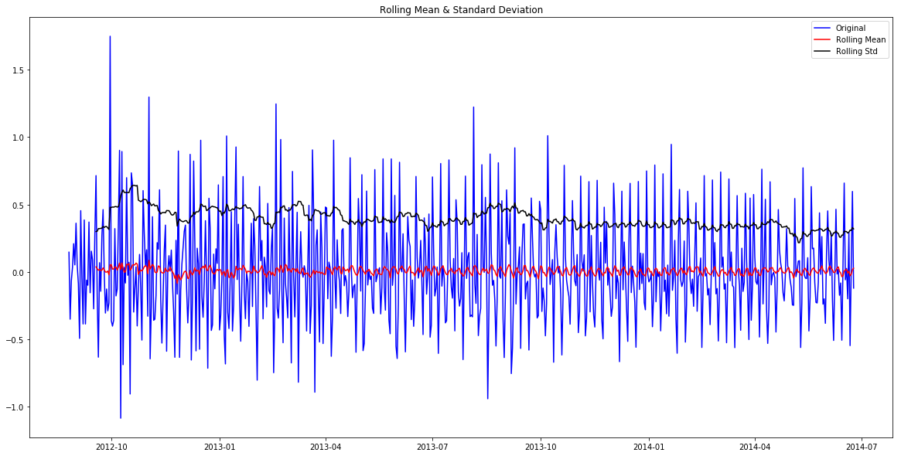


    Results of Dickey-Fuller Test:
    Test Statistic                -8.237568e+00
    p-value                        5.834049e-13
    #Lags Used                     1.900000e+01
    Number of Observations Used    6.480000e+02
    Critical Value (1%)           -3.440482e+00
    Critical Value (5%)           -2.866011e+00
    Critical Value (10%)          -2.569151e+00
    dtype: float64


```python
from statsmodels.tsa.seasonal import seasonal_decompose
decomposition = seasonal_decompose(pd.DataFrame(Train_log).Count.values, freq = 24)

trend = decomposition.trend
seasonal = decomposition.seasonal
residual = decomposition.resid

plt.subplot(411)
plt.plot(Train_log, label='Original')
plt.legend(loc='best')
plt.subplot(412)
plt.plot(trend, label='Trend')
plt.legend(loc='best')
plt.subplot(413)
plt.plot(seasonal,label='Seasonality')
plt.legend(loc='best')
plt.subplot(414)
plt.plot(residual, label='Residuals')
plt.legend(loc='best')
plt.tight_layout()
plt.show()
```


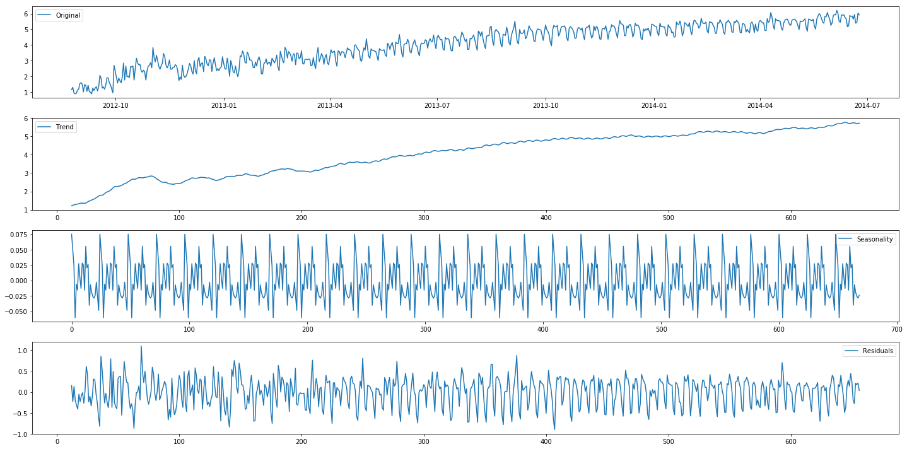


```python
from statsmodels.tsa.arima_model import ARIMA
```


```python
model = ARIMA(Train_log, order=(2, 1, 0))  # here the q value is zero since it is just the AR model
results_AR = model.fit(disp=-1)  
plt.plot(train_log_diff.dropna(), label='original')
plt.plot(results_AR.fittedvalues, color='red', label='predictions')
plt.legend(loc='best')
plt.show()
```


```python
AR_predict=results_AR.predict(start="2014-06-25", end="2014-09-25")
AR_predict=AR_predict.cumsum().shift().fillna(0)
AR_predict1=pd.Series(np.ones(valid.shape[0]) * np.log(valid['Count'])[0], index = valid.index)
AR_predict1=AR_predict1.add(AR_predict,fill_value=0)
AR_predict = np.exp(AR_predict1)
```


```python
plt.plot(valid['Count'], label = "Valid")
plt.plot(AR_predict, color = 'red', label = "Predict")
plt.legend(loc= 'best')
plt.title('RMSE: %.4f'% (np.sqrt(np.dot(AR_predict, valid['Count']))/valid.shape[0]))
plt.show()
```


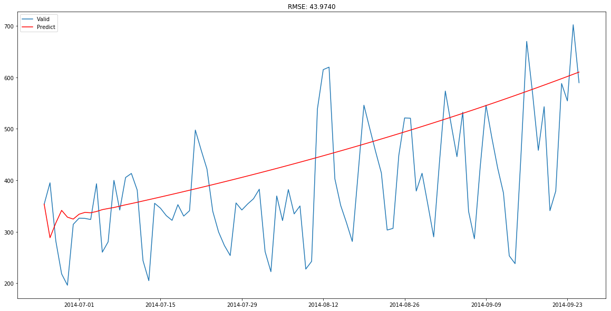


```python
model = ARIMA(Train_log, order=(0, 1, 2))  # here the p value is zero since it is just the MA model
results_MA = model.fit(disp=-1)  
plt.plot(train_log_diff.dropna(), label='original')
plt.plot(results_MA.fittedvalues, color='red', label='prediction')
plt.legend(loc='best')
plt.show()
```


```python
MA_predict=results_MA.predict(start="2014-06-25", end="2014-09-25")
MA_predict=MA_predict.cumsum().shift().fillna(0)
MA_predict1=pd.Series(np.ones(valid.shape[0]) * np.log(valid['Count'])[0], index = valid.index)
MA_predict1=MA_predict1.add(MA_predict,fill_value=0)
MA_predict = np.exp(MA_predict1)
```


```python
plt.plot(valid['Count'], label = "Valid")
plt.plot(MA_predict, color = 'red', label = "Predict")
plt.legend(loc= 'best')
plt.title('RMSE: %.4f'% (np.sqrt(np.dot(MA_predict, valid['Count']))/valid.shape[0]))
plt.show()
```


```python
model = ARIMA(Train_log, order=(2, 1, 2))  
results_ARIMA = model.fit(disp=-1)  
plt.plot(train_log_diff.dropna(),  label='original')
plt.plot(results_ARIMA.fittedvalues, color='red', label='predicted')
plt.legend(loc='best')
plt.show()
```


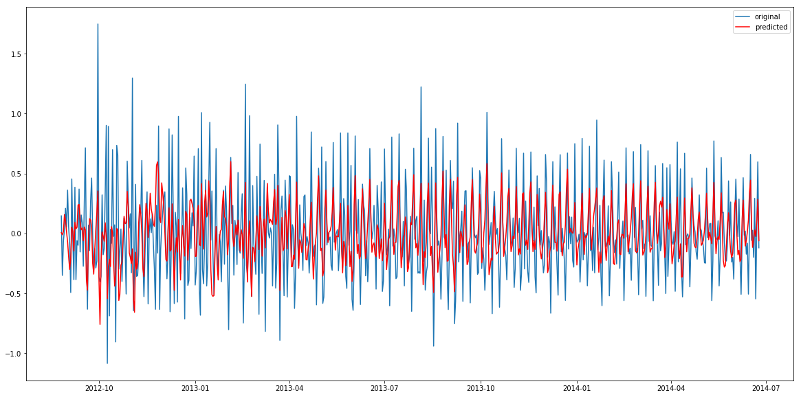


```python
def check_prediction_diff(predict_diff, given_set):
    predict_diff= predict_diff.cumsum().shift().fillna(0)
    predict_base = pd.Series(np.ones(given_set.shape[0]) * np.log(given_set['Count'])[0], index = given_set.index)
    predict_log = predict_base.add(predict_diff,fill_value=0)
    predict = np.exp(predict_log)

    plt.plot(given_set['Count'], label = "Given set")
    plt.plot(predict, color = 'red', label = "Predict")
    plt.legend(loc= 'best')
    plt.title('RMSE: %.4f'% (np.sqrt(np.dot(predict, given_set['Count']))/given_set.shape[0]))
    plt.show()
def check_prediction_log(predict_log, given_set):
    predict = np.exp(predict_log)

    plt.plot(given_set['Count'], label = "Given set")
    plt.plot(predict, color = 'red', label = "Predict")
    plt.legend(loc= 'best')
    plt.title('RMSE: %.4f'% (np.sqrt(np.dot(predict, given_set['Count']))/given_set.shape[0]))
    plt.show()
```


```python
ARIMA_predict_diff=results_ARIMA.predict(start="2014-06-25", end="2014-09-25")
```


```python
check_prediction_diff(ARIMA_predict_diff, valid)
```


```python
import statsmodels.api as sm
y_hat_avg = valid.copy()
fit1 = sm.tsa.statespace.SARIMAX(Train.Count, order=(2, 1, 4),seasonal_order=(0,1,1,7)).fit()
y_hat_avg['SARIMA'] = fit1.predict(start="2014-6-25", end="2014-9-25", dynamic=True)
plt.figure(figsize=(16,8))
plt.plot( Train['Count'], label='Train')
plt.plot(valid['Count'], label='Valid')
plt.plot(y_hat_avg['SARIMA'], label='SARIMA')
plt.legend(loc='best')
plt.show()
```

    /anaconda3/lib/python3.6/site-packages/statsmodels/base/model.py:508: ConvergenceWarning: Maximum Likelihood optimization failed to converge. Check mle_retvals
      "Check mle_retvals", ConvergenceWarning)


```python
rms = sqrt(mean_squared_error(valid.Count, y_hat_avg.SARIMA))
print(rms)
```

    69.59758295824821


```python
predict=fit1.predict(start="2014-9-26", end="2015-4-26", dynamic=True)
```

    /anaconda3/lib/python3.6/site-packages/statsmodels/tsa/statespace/kalman_filter.py:1740: ValueWarning: Dynamic prediction specified to begin during out-of-sample forecasting period, and so has no effect.
      ' effect.', ValueWarning)


```python
test['prediction']=predict
```


```python
# Merge Test and test_original on day, month and year
merge=pd.merge(test, test_original, on=('day','month', 'year'), how='left')
merge['Hour']=merge['Hour_y']
merge=merge.drop(['year', 'month', 'Datetime','Hour_x','Hour_y'], axis=1)

# Predicting by merging merge and temp2
prediction=pd.merge(merge, temp2, on='Hour', how='left')

# Converting the ratio to the original scale
prediction['Count']=prediction['prediction']*prediction['ratio']*24
```


```python
prediction['ID']=prediction['ID_y']
submission=prediction.drop(['day','Hour','ratio','prediction', 'ID_x', 'ID_y'],axis=1)

# Converting the final submission to csv format
pd.DataFrame(submission, columns=['ID','Count']).to_csv('SARIMAX.csv')
```
